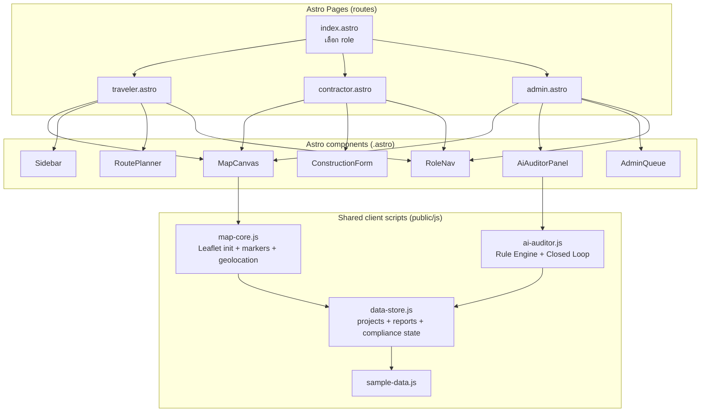

# Design Document — Astro Role-Separated Migration

## Overview

ย้าย GPS Construction Platform จาก single-page vanilla app (ที่ทุก role ยัดหน้าเดียว → UI ทับกันบนมือถือ) ไปเป็น **Astro multi-page app แยกตาม role** โดย **คงโค้ด GPS map เดิม (Leaflet) ไว้ทั้งหมด**

หลักการสำคัญ:
- **Astro เป็น HTML-first** → โค้ด vanilla JS/CSS ปัจจุบันยกไปใช้ได้เกือบทั้งดุ้น ไม่ต้อง rewrite เป็น React
- **3 route แยกกัน** เหมือน 3 แอป: `/traveler`, `/contractor`, `/admin` — แต่ละหน้าโหลดเฉพาะ panel ของ role นั้น (แก้ปัญหา UI ทับกัน)
- **Shared core** — map, data-store, sample-data, AI auditor ใช้ร่วมกันทั้ง 3 หน้า
- คง GPS map, route planner, drive simulation, AI Auditor, closed loop ที่ทำไว้แล้ว

## Architecture



## Components and Interfaces

### Role → Component/Feature Mapping

| Feature / Panel | Traveler | Contractor | Admin |
|---|:---:|:---:|:---:|
| Leaflet map + markers | ✅ (เฉพาะ zone ที่ published) | ✅ (งานตัวเอง) | ✅ (ทุก zone รวมที่ไม่ผ่าน) |
| Search + Sidebar (view) | ✅ | ✅ | ✅ |
| Locate / GPS | ✅ | ✅ | — |
| Route Planner + Drive sim | ✅ | — | — |
| Driver Alerts (proximity) | ✅ | — | — |
| Feedback / Report | ✅ | — | ✅ (ดู/จัดการ) |
| Construction Form (add/edit) | — | ✅ | — |
| Submit → trigger AI audit | — | ✅ | — |
| AI Auditor panel | — | ดูผลของตัวเอง | ✅ (รันตรวจ) |
| Approval Queue | — | — | ✅ |
| KPI dashboard | — | — | ✅ |
| Closed-loop publish/unpublish | — | — | ✅ |

### Shared Client Scripts (public/js/)

- **`data-store.js`** — global `projects`, `reports`, compliance state + localStorage persist/load. Source of truth ที่ทุกหน้าใช้ร่วม
- **`map-core.js`** — แยกจาก script.js เดิม: initMap, renderMarkers, geolocation, popup, clustering (ส่วนที่ทุก role ใช้)
- **`ai-auditor.js`** — คงเดิม (rule engine + closed loop + persist)
- **`route-planner.js`** — แยกจาก script.js: route calc + drive simulation (เฉพาะ traveler)
- **`sample-data.js`** — 15+ zones

### Astro Components (src/components/)

| Component | ใช้โดย | เนื้อหา |
|---|---|---|
| `MapCanvas.astro` | ทุก role | `<div id="map">` + สั่ง initMap ตาม role config |
| `Sidebar.astro` | ทุก role | project list + filters + search |
| `RoutePlanner.astro` | traveler | route form + drive controls |
| `ConstructionForm.astro` | contractor | ฟอร์มเพิ่มงาน + upload |
| `AiAuditorPanel.astro` | admin | scenario select + audit + report display |
| `AdminQueue.astro` | admin | approval queue + KPI tabs |
| `DetailModal.astro` | ทุก role | รายละเอียด zone |
| `RoleNav.astro` | ทุก role | nav bar (เมนูต่างกันตาม role) |

### Page Composition

```astro
// traveler.astro
<BaseLayout title="เดินทาง">
  <MapCanvas role="traveler" />
  <Sidebar readonly />
  <RoutePlanner />
  <RoleNav role="traveler" />
  <script>window.APP_ROLE = "traveler";</script>
</BaseLayout>
```
แต่ละหน้ากำหนด `window.APP_ROLE` → map-core อ่านค่านี้เพื่อ filter markers/behavior ตาม role

## Data Models

ใช้ data model เดิมจาก spec `gps-construction-platform` (ไม่เปลี่ยน):
- `ConstructionZone` — เพิ่ม `publishedToDrivers`, `complianceVerdict`, `complianceScore`
- `ComplianceReport`, `Feedback`, `DriverAlert`, `ContractorKPI`

state ยังเก็บใน browser (localStorage) — ไม่มี backend ใน POC

## Migration Strategy (สำคัญ)

**หลักการ: reuse ให้มากสุด, rewrite ให้น้อยสุด**

1. **สร้าง Astro shell** — scaffold project, BaseLayout, 4 pages ว่างๆ
2. **ยก CSS ทั้งไฟล์** — `style.css` copy ไป `public/css/` ใช้เหมือนเดิม
3. **แตก `script.js` (2000 บรรทัด) เป็น modules** — map-core / route-planner / reports โดยไม่แก้ logic (แค่แยกไฟล์ + จัดการ global scope)
4. **แตก HTML panels** เป็น `.astro` components — copy markup เดิม
5. **ประกอบแต่ละ page** — ใส่เฉพาะ component ของ role นั้น
6. **เพิ่ม role guard ใน map-core** — filter markers/features ตาม `window.APP_ROLE`
7. **ทดสอบทีละ role**

**ความเสี่ยง:** script.js ใช้ global variables เยอะ (`map`, `projects`, `selectedProjectId`) การแตกไฟล์ต้องระวัง load order — แก้โดยให้ทุก module attach ไป `window` หรือใช้ single bundle เดิมก่อน แล้วค่อยแตก
