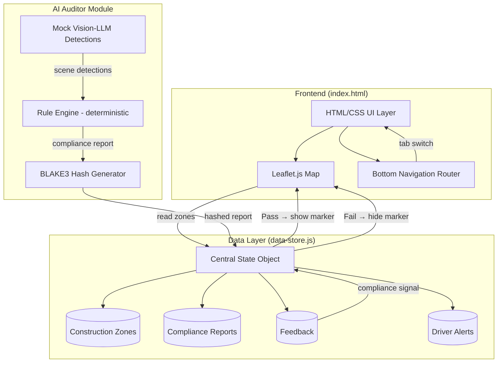
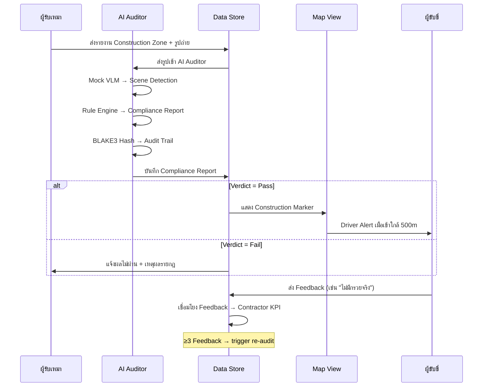

# Design Document — GPS Construction Platform

## Overview

ระบบ GPS Construction Platform เป็น client-side prototype สำหรับ DOH Hackathon 2026 พัฒนาด้วย vanilla JavaScript + Leaflet.js + OpenStreetMap โดยไม่มี backend — ข้อมูลทั้งหมดอยู่ใน browser memory (in-memory JS store)

**แนวคิดสถาปัตยกรรม:**
- **No framework** — vanilla JS เพื่อความเร็วในการพัฒนา (hackathon)
- **Single HTML page** — tab routing ผ่าน Bottom Nav
- **Central state** — data-store.js เป็น single source of truth
- **AI Auditor logic จริง** — port Rule Engine จาก Rust compliance-auditor crate มาเป็น JS (deterministic) โดยใช้ mock detection แทน Vision-LLM จริง
- **BLAKE3 hash** — ใช้ js-blake3 library สำหรับ tamper-evident reports
- **Mobile-first** — responsive design, UI ภาษาไทยทั้งหมด

## Architecture



### Closed-Loop Data Flow (ลำดับการไหลของข้อมูล)



## Components and Interfaces

### 3.1 Map Component (`map.js`)

**หน้าที่:** จัดการแผนที่ Leaflet.js ทั้งหมด

| ฟังก์ชัน | รายละเอียด |
|----------|------------|
| `initMap()` | สร้าง Leaflet map, center ที่ไทย (13.736, 100.523), zoom 6 |
| `loadMarkers()` | อ่าน zones จาก data-store, สร้าง markers ตามสถานะ/สี |
| `setupClustering()` | ใช้ Leaflet.markerCluster, threshold 40px |
| `getCurrentLocation()` | Geolocation API → marker ผู้ใช้ |
| `zoomToZone(zoneId)` | Fly to zone ที่ zoom level 15 |
| `updateMarkerVisibility()` | ซ่อน/แสดง marker ตาม compliance verdict |

**สี Marker:**
- 🟢 Completed = `#22c55e`
- 🟡 In Progress = `#eab308`
- 🔴 Delayed = `#ef4444`
- 🔵 Planned = `#3b82f6`

**Popup content:** ชื่อโครงการ, สถานะ, ผู้รับเหมา, วันเริ่ม/สิ้นสุด, ปุ่ม "ดูรายละเอียด"

### 3.2 Sidebar Component (`sidebar.js`)

**หน้าที่:** แสดงรายการ Construction Zone ในแถบด้านข้าง

| ฟังก์ชัน | รายละเอียด |
|----------|------------|
| `renderZoneList()` | อ่าน zones จาก store, render เป็น list items |
| `handleSearch(query)` | กรองรายการตาม keyword (ชื่อ/ทางหลวง/ผู้รับเหมา) |
| `handleZoneClick(zoneId)` | เรียก `map.zoomToZone()` + highlight item |
| `toggleSidebar()` | เปิด/ปิด sidebar บน mobile |

**Behavior:** scrollable list, สูงสุด 30 items, คลิกเพื่อ zoom ไปที่ marker

### 3.3 Bottom Navigation (`app.js`)

**หน้าที่:** Tab routing — สลับ view โดยซ่อน/แสดง section

| Tab | View | หมายเหตุ |
|-----|------|----------|
| Home | Map + Sidebar | หน้าหลัก |
| Projects | Contractor Reporting | ฟอร์มส่งรายงาน |
| AI | AI Auditor Tab | **wow moment** |
| Notifications | Alert History | รายการแจ้งเตือน |
| Profile | Admin Module | สำหรับ DOH Admin |

**Implementation:** แต่ละ tab เป็น `<section>` ที่ toggle `display:none/block`, active tab มี highlight class

### 3.4 Contractor Reporting Module (`contractor.js`)

**หน้าที่:** Form wizard สำหรับผู้รับเหมาส่งรายงาน Construction Zone

**ขั้นตอน (Steps):**
1. **ข้อมูลโครงการ** — ชื่อ (1-200 chars), หมายเลขทางหลวง, ช่วง กม. (start < end)
2. **ตำแหน่ง** — พิกัด GPS (ใน bounding box ไทย: lat 5.5–20.5, lng 97.3–105.7)
3. **รูปถ่าย** — อัปโหลด 1-10 รูป (JPEG/PNG, max 5MB/รูป), ประทับ timestamp + พิกัด
4. **ยืนยัน** — แสดง preview, ส่งเข้า data-store

**Validation rules:**
- กม.เริ่มต้น < กม.สิ้นสุด
- พิกัดอยู่ในขอบเขตไทย
- ฟิลด์จำเป็นครบ → ถ้าไม่ครบ ปฏิเสธพร้อมระบุฟิลด์ที่ขาด
- ตรวจ overlap กับ zones ที่มีอยู่ → แจ้งเตือนก่อนบันทึก

**เมื่อส่งสำเร็จ:** ตั้ง zone_status = "planned", ประทับเวลา ISO 8601, trigger AI audit

### 3.5 AI Auditor Module (`ai-auditor.js`)

**หน้าที่:** ตรวจสอบมาตรฐานหน้างาน — **หัวใจของระบบ (Wow #1)**

**สถาปัตยกรรมภายใน (ported จาก Rust compliance-auditor):**

```
┌─────────────────────────────────────────────────┐
│  Mock Vision-LLM (mockDetection fixtures)       │
│  → สร้าง SceneDetection object                  │
└──────────────────┬──────────────────────────────┘
                   ↓
┌─────────────────────────────────────────────────┐
│  Rule Engine (deterministic, ported from Rust)  │
│  • evaluateRule() — MinObjectCount              │
│  • evaluateRule() — MaxSpacing                  │
│  • evaluateRule() — RequiredWithinDistance       │
│  • evaluateRule() — TimeWindow                  │
│  • computeSpacing(), countObjects()             │
│  • Score deduction: Warning -5, Moderate -15,   │
│                     Critical -35               │
└──────────────────┬──────────────────────────────┘
                   ↓
┌─────────────────────────────────────────────────┐
│  BLAKE3 Hash (js-blake3 library)                │
│  → tamper-evident audit trail                   │
└──────────────────┬──────────────────────────────┘
                   ↓
│  Compliance Report JSON → แสดงใน AI Tab         │
```

**Rule Engine Logic (ported จาก `rule_engine.rs`):**

```javascript
// Severity score deductions (เหมือน Rust crate)
const DEDUCTIONS = { warning: 5, moderate: 15, critical: 35 };

// ComplianceStatus mapping
// Pass          = ไม่มีกฎไหนไม่ผ่าน
// PassWithWarnings = worst severity = warning
// Fail          = worst severity = moderate
// CriticalFail  = worst severity = critical

function evaluate(permit, rules, sceneDetection, zoneLengthM) {
  let score = 100;
  const results = rules.map(rule => {
    const result = evaluateSingleRule(rule, sceneDetection, zoneLengthM);
    if (!result.passed) score -= DEDUCTIONS[result.severity] || 0;
    return result;
  });
  score = Math.max(0, Math.min(100, score));
  const hash = blake3(JSON.stringify(results));
  return { reportId: `CR-${hash.slice(0,8)}`, score, results, hash };
}
```

**การแสดงผลใน AI Tab:**
- Upload/เลือกรูปถ่าย → แสดง preview
- กดปุ่ม "ตรวจสอบมาตรฐาน" → แสดง loading (mock delay 1-2s)
- แสดงผล: Verdict (Pass/Fail), คะแนน (0-100), วัตถุที่ตรวจพบ, ผลรายกฎ (ผ่าน/ไม่ผ่าน + severity), ข้อเสนอแนะ
- แสดง Audit Hash (BLAKE3) สำหรับ tamper-evidence

### 3.6 Alert System (`alerts.js`)

**หน้าที่:** ตรวจจับ proximity + แจ้งเตือนผู้ขับขี่

| ฟังก์ชัน | รายละเอียด |
|----------|------------|
| `startProximityWatch()` | watchPosition() → เช็คระยะทุก position update |
| `checkProximity(userPos)` | คำนวณ Haversine distance กับทุก published zone |
| `triggerAlert(zone)` | แสดง alert UI (ชื่อ, ทางหลวง, ช่องปิด, ความเร็ว) |
| `suppressAlert(zoneId)` | ไม่แจ้งซ้ำจนกว่าออกจาก radius หรือ >5 นาที |
| `getAlertHistory()` | คืนรายการ alerts เรียงจากใหม่→เก่า |

**Suppression logic:**
- เก็บ `suppressedAlerts = Map<zoneId, { timestamp, exited }>` 
- ไม่แจ้งซ้ำ ถ้า `!exited && (now - timestamp) < 5min`
- Reset เมื่อ distance > Alert_Radius หรือ elapsed > 5min

### 3.7 Feedback Module (`feedback.js`)

**หน้าที่:** ฟอร์มส่ง feedback จากผู้ขับขี่

**ฟิลด์:**
- ประเภทปัญหา (required): dropdown — ไม่มีกรวย / ป้ายไม่ชัด / ไม่ตรงข้อมูล / อื่นๆ
- คำอธิบาย (optional): textarea max 500 chars
- รูปถ่าย (optional): 1 รูป
- ตำแหน่ง: auto-fill จาก geolocation
- Construction Zone ที่เกี่ยวข้อง: auto-link จาก nearest zone

**Rate limiting:** max 5 feedback / 10 นาที (เก็บ timestamps ใน array, เช็ค sliding window)

### 3.8 Admin Module (`admin.js`)

**หน้าที่:** หน้า DOH Admin — ตรวจสอบ/อนุมัติ zones, จัดการ feedback, ดู KPI

**3 sub-views:**

1. **Approval Queue** — รายการ zones ที่รอตรวจสอบ, แสดง Compliance Report + Verdict + คะแนน, ปุ่ม อนุมัติ/ปฏิเสธ (ต้องระบุเหตุผล ≥10 chars)
2. **Feedback Queue** — รายการ feedback จากประชาชน, กรองตาม status (รอตรวจสอบ/ดำเนินการแล้ว), ปุ่ม mark as resolved
3. **Contractor KPI** — ตาราง KPI ผู้รับเหมา (คะแนน 0-100), สัญญาณ: จำนวน feedback, compliance score เฉลี่ย, ค่าฐาน = 100

**Concurrency:** ใช้ version counter — ถ้า state เปลี่ยนแล้ว (stale) แจ้ง admin ให้ refresh

## Data Models

### 4.1 ConstructionZone

```javascript
{
  id: "zone-uuid-001",              // unique identifier
  projectName: "ขยายถนน 4 ช่อง ทล.1",
  highwayNumber: "1",
  startKm: 45.2,
  endKm: 47.8,
  zoneLengthM: 2600,                 // (endKm - startKm) * 1000
  lat: 14.0723,
  lng: 100.6048,
  workType: "ขยายช่องจราจร",
  contractor: "บจก.ไทยก่อสร้าง",
  status: "in_progress",             // planned | in_progress | delayed | completed
  progress: 45,                      // 0-100%
  startDate: "2026-03-01",
  endDate: "2026-09-30",
  photos: [{ url, timestamp, lat, lng, isFallbackCoord }],
  complianceVerdict: "pass",         // pass | fail | pending | null
  complianceReportId: "CR-a1b2c3d4",
  publishedToDrivers: true,          // ปรากฏบนแผนที่ผู้ขับขี่หรือไม่
  closedLanes: "ช่องซ้าย 1 ช่อง",
  speedLimit: 60,                    // km/h
  createdAt: "2026-03-01T08:00:00+07:00",
  updatedAt: "2026-05-10T14:30:00+07:00",
  version: 3                         // for optimistic concurrency
}
```

### 4.2 ComplianceReport

```javascript
{
  reportId: "CR-a1b2c3d4",
  zoneId: "zone-uuid-001",
  permitId: "DOH-2026-0042",
  highwayNumber: "1",
  kmMarker: "45.2-47.8",
  inspectedAt: "2026-05-10T14:30:00+07:00",
  overallStatus: "pass",             // pass | pass_with_warnings | fail | critical_fail
  overallScore: 85,                  // 0-100
  ruleResults: [
    {
      ruleId: "DOH-SAFETY-001",
      ruleDescription: "กรวยจราจรต้องมีอย่างน้อย 10 ชิ้น",
      passed: true,
      actualValue: "12 ชิ้น",
      requiredValue: "≥ 10 ชิ้น",
      severity: null,                // warning | moderate | critical | null
      recommendation: null,
      rejectConfidence: 0.0          // 0.0–1.0 (sigmoid-inspired)
    }
  ],
  recommendations: ["ติดตั้งไฟกะพริบเพิ่มในช่วงกลางคืน"],
  reportHash: "b3a1c2d4e5f6..."      // BLAKE3 hash (tamper-evident)
}
```

### 4.3 Feedback

```javascript
{
  id: "fb-uuid-001",
  zoneId: "zone-uuid-001",          // linked Construction Zone
  problemType: "no_cones",           // no_cones | unclear_signs | data_mismatch | other
  description: "จุดนี้ไม่มีกรวยจริง ไม่ตรงกับข้อมูล",  // max 500 chars
  photoUrl: null,                    // optional
  lat: 14.0725,
  lng: 100.6050,
  status: "pending",                 // pending | resolved
  resolvedBy: null,                  // admin id
  resolvedAt: null,
  createdAt: "2026-05-11T09:15:00+07:00"
}
```

### 4.4 DriverAlert

```javascript
{
  id: "alert-uuid-001",
  zoneId: "zone-uuid-001",
  projectName: "ขยายถนน 4 ช่อง ทล.1",
  highwayNumber: "1",
  closedLanes: "ช่องซ้าย 1 ช่อง",
  speedLimit: 60,
  distanceM: 423,                    // ระยะห่าง (เมตร) ขณะแจ้งเตือน
  triggeredAt: "2026-05-11T08:30:00+07:00",
  dismissed: false
}
```

### 4.5 ContractorKPI

```javascript
{
  contractorName: "บจก.ไทยก่อสร้าง",
  score: 85,                         // 0-100 (ค่าฐาน = 100)
  totalZones: 5,
  passedAudits: 4,
  failedAudits: 1,
  totalFeedback: 3,
  pendingFeedback: 1,
  avgComplianceScore: 82,
  lastUpdated: "2026-05-11T10:00:00+07:00"
}
```

## File Structure

```
gps-construction/
├── index.html              # Single page, all sections/tabs
├── css/
│   └── style.css           # Mobile-first responsive, Thai fonts
├── js/
│   ├── app.js              # Main entry, tab routing, state init
│   ├── map.js              # Leaflet map, markers, clustering, geolocation
│   ├── sidebar.js          # Zone list, search, click-to-zoom
│   ├── contractor.js       # Reporting form wizard, validation
│   ├── ai-auditor.js       # Mock VLM + Rule Engine + report display
│   ├── alerts.js           # Proximity detection, alert UI, suppression
│   ├── feedback.js         # Citizen feedback form, rate limiting
│   ├── admin.js            # Approval queue, KPI dashboard, feedback mgmt
│   ├── data-store.js       # Central state management (single source of truth)
│   └── sample-data.js      # 20-30 mock construction zones ทั่วไทย
├── assets/
│   ├── icons/              # Status icons, nav icons (SVG)
│   └── images/             # Sample photos for mock audit
└── README.md               # Setup instructions
```

## Key Technical Decisions

| Decision | เหตุผล |
|----------|--------|
| Vanilla JS (no React/Vue) | ลดความซับซ้อน, ไม่ต้อง build step, เร็วสำหรับ hackathon |
| Leaflet.js | ฟรี, ไม่ต้อง API key, รองรับภาษาไทย, community plugins เยอะ |
| OpenStreetMap tiles | ฟรี, ไม่จำกัด requests ใน dev, มีข้อมูลไทยครบ |
| Central JS object (data-store.js) | Single source of truth — ง่ายต่อ closed-loop demo |
| Rule Engine port จาก Rust | Logic จริง (deterministic), demo ได้จริง, ไม่ใช่ placeholder |
| js-blake3 (CDN) | BLAKE3 hash สำหรับ tamper-evident reports, เหมือน Rust crate |
| Mock Vision-LLM detections | POC ไม่ต้อง call API จริง แต่ Rule Engine ทำงานจริง |
| Mobile-first CSS | Target audience = ผู้ขับขี่บน mobile |
| Thai language UI | Hackathon theme + target users = คนไทย |
| No bundler/transpiler | เปิด index.html ได้เลย, zero setup |

## Build Sequencing

### Phase 1A: Map + Markers + Sidebar + Bottom Nav (Req 1, 2)

- [ ] สร้าง `index.html` + `style.css` (layout, responsive grid)
- [ ] Leaflet map initialization, center ไทย, zoom controls
- [ ] `sample-data.js` — 20-30 zones ทั่วไทย
- [ ] `data-store.js` — central state object
- [ ] Render markers (สีตาม status) + popup
- [ ] Marker clustering (Leaflet.markerCluster)
- [ ] Sidebar zone list + search + click-to-zoom
- [ ] Bottom Navigation (5 tabs) + tab routing
- [ ] Geolocation button + user marker
- [ ] Status legend
- [ ] Responsive breakpoints (mobile/tablet/desktop)
- [ ] Loading indicator + error state + offline message

### Phase 1B: Contractor Reporting (Req 3)

- [ ] Form wizard UI (4 steps)
- [ ] Field validation (km range, coordinates, required fields)
- [ ] Photo upload (File API) + preview + metadata stamping
- [ ] Overlap detection + warning
- [ ] Zone creation → data-store update → map refresh

### Phase 2: AI Auditor Tab — **wow moment** (Req 4)

- [ ] AI Tab UI (upload area + results display)
- [ ] Mock Vision-LLM fixtures (sample scene detections)
- [ ] Rule Engine port (evaluate, score deduction, status mapping)
- [ ] BLAKE3 hash generation (js-blake3)
- [ ] Compliance Report display (verdict, score gauge, per-rule results)
- [ ] Mock delay + loading animation (simulate real inference)
- [ ] Error handling (retry logic display)

### Phase 3: Closed Loop + Alerts + Feedback (Req 5, 6)

- [ ] Compliance verdict → publish/unpublish zone on map
- [ ] Re-audit trigger (on zone edit, on 3+ feedback)
- [ ] Proximity detection (Haversine + watchPosition)
- [ ] Driver Alert UI (toast/banner style)
- [ ] Alert suppression logic (5 min / exit radius)
- [ ] Alert history (Notifications tab)
- [ ] Feedback form + validation + rate limiting
- [ ] Feedback → zone linkage (compliance signal)

### Phase 4: Admin Module (Req 7)

- [ ] Approval queue (list + approve/reject)
- [ ] Reject requires reason ≥10 chars
- [ ] Feedback management queue
- [ ] Contractor KPI dashboard
- [ ] Admin override (AI advisory, admin decision = final)
- [ ] Optimistic concurrency (version check)
- [ ] Empty state handling

---

> **หมายเหตุ:** เอกสารนี้เป็น design สำหรับ hackathon POC — มุ่งเน้นความรวดเร็วในการพัฒนาและ demo-ability ไม่ใช่ production-grade architecture
