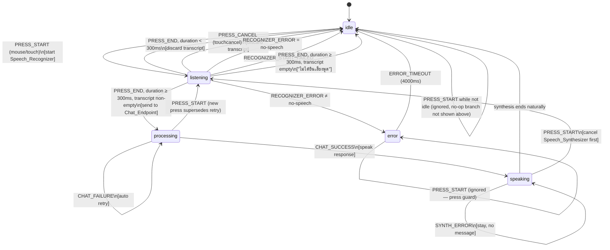

# Design Document

## Overview

ระบบเสียงเดิมของย่านาง AI (`toggleVoice()` ใน `static/app.js`) เป็นปุ่ม toggle ธรรมดา: กดครั้งแรกเริ่มฟัง กดอีกครั้งหยุดฟัง ไม่มี state machine ชัดเจน ไม่มีการจัดการ double-trigger ระหว่าง mouse/touch และไม่มีการแนบบริบทตำแหน่ง/โครงการก่อสร้างไปกับคำขอ

ฟีเจอร์นี้แทนที่กลไกเดิมด้วยโมดูลใหม่ `static/voice-controller.js` ที่ implement **push-to-talk state machine** อย่างชัดเจน (idle → listening → processing → speaking → error) โดย:

- **แยกโมดูลใหม่** (`VoiceController`) ออกจาก `app.js` แทนการฝัง logic เพิ่มเข้าไปใน `toggleVoice()`/`startVoice()`/`stopVoice()` เดิม เพราะ state machine ที่มี 5 สถานะและ 20 properties ที่ต้องพิสูจน์ถูกต้องนั้นสมควรมี "หน่วยทดสอบได้เดี่ยว ๆ" (pure reducer) แยกจาก DOM/side-effects — เป็นไปตามหลัก testability ที่ต้องการในงานนี้
- **คง `app.js` เดิมไว้ตามที่เป็น** สำหรับ `sendMessage()` (การพิมพ์) แต่ **สกัด (extract) ฟังก์ชันที่ใช้ร่วมกัน** (post ไปยัง `/api/chat`, จัดการ history, addChat, speakThai) ออกมาเป็น bridge object บน `window` เพื่อให้ `voice-controller.js` เรียกใช้ได้โดยไม่ duplicate logic และไม่ผูก scope กับตัวแปรภายใน `app.js`
- **ใช้ mousedown/touchstart/mouseup/touchend/touchcancel/mouseleave ตามที่ requirements ระบุไว้ตรง ๆ** ไม่เปลี่ยนไปใช้ Pointer Events API — เหตุผล: acceptance criteria ของ Requirement 3 (double-trigger prevention) ถูกเขียนขึ้นโดยอ้างอิงพฤติกรรมเฉพาะของ legacy mouse+touch event model ตรง ๆ (เช่น "touchstart ต้อง preventDefault เพื่อระงับ synthetic mouse event" และ "Press_Session ระบุด้วย pointer type") ซึ่งเป็นวิธีแก้ปัญหา double-trigger ที่ requirements เลือกไว้แล้ว การเปลี่ยนไปใช้ Pointer Events จะทำให้ AC เหล่านี้ตีความไม่ตรงกับพฤติกรรมที่ทดสอบจริง จึง cover ตรงตาม requirements เป็นหลัก
- **ขยาย `/api/chat` (`src/routes/chat.rs`)** ให้รับ field เสริม `voice_context` (optional) แล้ว inject เข้า system prompt แบบ backward-compatible (คำขอเดิมที่ไม่มี field นี้ยังทำงานเหมือนเดิมทุกประการ)

Out of scope (ตาม requirements): wake-word detection, always-listening mode, multi-turn memory ที่ซับซ้อนกว่า `messageHistory` ที่มีอยู่แล้ว

## Architecture

```mermaid
graph TB
    subgraph Browser
        IDX[index.html]
        APP[app.js<br/>sendMessage / addChat / speakThai<br/>+ YanangChatBridge]
        MAP[map.js<br/>window.userPos]
        ALERTS[alerts.js<br/>+ getNearbyProjects]
        VC[voice-controller.js<br/>VoiceController class<br/>pure reducer + effect runner]
        STYLE[style.css<br/>voice-btn.listening/.processing/.speaking/.error]
    end
    subgraph Server (yanang-ai / axum)
        CHAT[routes/chat.rs<br/>chat_handler]
        TPL[prompts/templates.rs<br/>build_guardrailed_prompt]
        CONST[routes/construction.rs<br/>/api/construction/projects]
        LLM[api/thaillm.rs<br/>ThaiLLM API]
    end

    IDX -->|script order: alerts, map, app, voice-controller| VC
    VC -->|reads| MAP
    VC -->|calls getNearbyProjects| ALERTS
    VC -->|calls postChat / getActiveStyle / pushHistory| APP
    VC -->|toggles classes on #voice-btn| STYLE
    APP -->|POST /api/chat with optional voice_context| CHAT
    CHAT --> TPL
    CHAT --> LLM
    ALERTS --> CONST
```

### Why a separate module

`app.js` currently owns module-scoped `let` bindings (`currentStyle`, `messageHistory`, `recognition`, `isListening`) and DOM-bound functions (`sendMessage`, `addChat`, `speakThai`, `setStyle`). Rewriting the voice interaction in place would mean weaving a 5-state machine through the same file that also handles navigation, chat, and map wiring — hard to test in isolation and risky to regress.

Instead:

1. `static/voice-controller.js` contains a pure, dependency-injected `VoiceController` class with no direct DOM/Web Speech API calls in its core transition logic — those are passed in as collaborators (`recognizer`, `synthesizer`, `chatBridge`, `clock`). This lets the state machine be property-tested with fakes/mocks, without a browser.
2. `app.js` gains a small `window.YanangChatBridge` object exposing exactly what voice-controller.js needs: `getActiveStyle()`, `getHistory()`, `pushHistory(user, ai)`, `postChat(payload)`, `addChat(role, text)`, `speakThai(text)`. `sendMessage()` is refactored internally to also use `postChat`/`pushHistory` so both flows share one code path to `/api/chat`.
3. `alerts.js` gains one new exported function `getNearbyProjects(lat, lng, maxDistanceM)` reusing the existing `haversineM` helper, so voice-controller.js can build `Voice_Context_Payload` without duplicating distance math.
4. `index.html` loads scripts in order: `alerts.js`, `map.js`, `app.js`, `voice-controller.js` (new, loaded last since it depends on the others being defined).

## Components and Interfaces

### VoiceController (static/voice-controller.js)

```js
class VoiceController {
  constructor({ button, recognizer, synthesizer, chatBridge, clock = Date, minPressDurationMs = 300, errorDisplayMs = 4000 }) { ... }

  // Public: wired to #voice-btn DOM listeners
  handleMouseDown(e) { ... }
  handleTouchStart(e) { ... }
  handleMouseUp(e) { ... }
  handleTouchEnd(e) { ... }
  handleTouchCancel(e) { ... }
  handleMouseLeave(e) { ... }

  // Recognizer/synthesizer callbacks
  handleRecognizerResult(transcript) { ... }
  handleRecognizerError(errorCode) { ... }
  handleRecognizerStartFailure() { ... }
  handleSynthesizerError() { ... }

  // Introspection (used by rendering + tests)
  getState() { return this.state; } // 'idle' | 'listening' | 'processing' | 'speaking' | 'error'
}
```

Internally, `VoiceController` delegates every event to a **pure reducer function** so the transition logic itself has no side effects and can be unit/property tested directly:

```js
// Pure — no DOM, no timers, no network. Returns next state + a list of effects to run.
function reduce(state, session, event) {
  // state: 'idle' | 'listening' | 'processing' | 'speaking' | 'error'
  // session: PressSession | null
  // event: { type: 'PRESS_START' | 'PRESS_END' | 'PRESS_CANCEL' | 'RECOGNIZER_RESULT'
  //        | 'RECOGNIZER_ERROR' | 'RECOGNIZER_START_FAILED' | 'CHAT_SUCCESS' | 'CHAT_FAILURE'
  //        | 'SYNTH_ERROR' | 'ERROR_TIMEOUT', ...payload }
  // returns: { state, session, effects: Effect[] }
}
```

`Effect` values are plain descriptors (`{ type: 'START_RECOGNIZER' }`, `{ type: 'STOP_RECOGNIZER' }`, `{ type: 'CANCEL_SYNTH' }`, `{ type: 'SEND_CHAT', transcript, generation }`, `{ type: 'SCHEDULE_ERROR_TIMEOUT' }`, `{ type: 'RENDER' }`, ...) that a thin "effect runner" inside `VoiceController` executes against the real `recognizer`/`synthesizer`/`chatBridge`/DOM. This separation is what makes properties 1–14 and 17–18 testable without a browser: tests call `reduce()` directly with generated states/events and assert on the returned `{state, effects}`.

#### Press_Session shape

```js
// PressSession
{
  pointerType: 'mouse' | 'touch',
  startedAt: number,       // ms timestamp from clock.now()
  cancelled: boolean,      // set true by touchcancel / superseded mouseleave
  generation: number,      // monotonically increasing id, used to abandon stale retries
}
```

`generation` is incremented every time a *new* Press_Session is created (including the speaking→listening exception). Any in-flight retry loop or pending recognizer callback captures the `generation` it started with; if the current session's generation has moved on by the time the effect resolves, the effect is a no-op. This is the mechanism behind Property 8 and Property 9 (retry abandonment / stale-event idempotency).

### State Machine



Note: presses while `processing` or `error` are ignored (no transition) per the press-guard invariant (Property 1); the only non-idle state that accepts a new press is `speaking`.

### app.js changes (extraction, not rewrite)

- New `window.YanangChatBridge`:
  - `getActiveStyle()` — returns `currentStyle` if it is one of the 5 known keys, else `null` (used to detect the "cannot determine valid style" branch of Property 18).
  - `getHistory()` — returns `messageHistory.slice(-10)`.
  - `pushHistory(userText, aiText)` — appends both turns to `messageHistory`.
  - `postChat(payload)` — `fetch('/api/chat', { method: 'POST', ... })`, returns parsed JSON or throws (network/HTTP error). No retry logic here — retries are the voice controller's responsibility, since Requirement 2.6 is scoped to voice `processing` state, not to typed messages.
  - `addChat(role, text)`, `speakThai(text)` — re-exported references to the existing functions.
- `sendMessage()` is refactored to call `YanangChatBridge.postChat({ message, style: currentStyle, history })` internally instead of inlining `fetch`, so both code paths hit one implementation of the actual HTTP call.

### alerts.js changes

- New exported function:
  ```js
  // Returns Nearby_Construction_Project entries within maxDistanceM (default 1000m per glossary),
  // sorted by ascending distance. Pure given (lat, lng, window.constructionProjects).
  function getNearbyProjects(lat, lng, maxDistanceM = 1000) { ... }
  window.DriverAlerts.getNearbyProjects = getNearbyProjects;
  ```
  Reuses the existing `haversineM`. Kept separate from `ALERT_RADIUS_M` (500m, used for driving alerts) since the voice-context radius is defined independently in the glossary (1km).

### style.css changes

`.voice-btn` already has `.listening` and `.speaking`. Two more are added, reusing `--primary`/existing shadow tokens so the visual language stays consistent:

```css
.voice-btn.processing { background: #f0f0f0; animation: voiceProcessingSpin 0.9s linear infinite; }
.voice-btn.error { background: #e74c3c; animation: voiceErrorShake 0.4s ease-in-out; }

@keyframes voiceProcessingSpin { /* rotating ring/dots distinct from the listening pulse */ }
@keyframes voiceErrorShake { /* short shake, distinct from listening's pulse and processing's spin */ }
```

`VoiceController`'s render effect sets exactly one of `listening | processing | speaking | error` as a class on `#voice-btn` and removes the other three, guaranteeing Property 10 and Property 11 (no leftover class from a prior state, no two states sharing a class set).

### chat.rs changes

```rust
#[derive(Debug, Deserialize)]
pub struct ChatRequest {
    pub message: String,
    pub style: Option<String>,
    pub history: Option<Vec<Message>>,
    /// New, optional — present only for requests originating from Voice_Controller.
    /// Absent entirely for typed messages (backward compatible).
    pub voice_context: Option<VoiceContext>,
}

#[derive(Debug, Deserialize)]
pub struct VoiceContext {
    pub location: Option<GeoPoint>,
    pub nearby_projects: Option<Vec<NearbyProjectContext>>,
}

#[derive(Debug, Deserialize)]
pub struct GeoPoint {
    pub lat: f64,
    pub lng: f64,
}

#[derive(Debug, Deserialize)]
pub struct NearbyProjectContext {
    pub name: String,
    pub road_name: String,
    pub distance_m: f64,
    pub compliance_verdict: String,
}
```

`chat_handler` gains a pure helper, tested independently of Axum/HTTP:

```rust
/// Pure — builds the extra system-prompt fragment for voice context, or None if absent.
fn build_voice_context_prompt_fragment(ctx: &Option<VoiceContext>) -> Option<String> { ... }
```

`build_guardrailed_prompt` output is then extended:

```rust
let mut system_prompt = build_guardrailed_prompt(&style, intent_context);
if let Some(fragment) = build_voice_context_prompt_fragment(&req.voice_context) {
    system_prompt.push_str("\n\n");
    system_prompt.push_str(&fragment);
}
```

When `req.voice_context` is `None` (every existing typed-message request, and any voice request where the frontend could not collect location/nearby data), `system_prompt` is byte-for-byte identical to current behavior — satisfying Requirement 7.5.

## Data Models

### Voice_Context_Payload (frontend → wire format, camelCase JSON)

```ts
type VoiceContextPayload = {
  location?: { lat: number; lng: number };
  nearbyProjects?: Array<{
    name: string;
    roadName: string;
    distanceM: number;
    complianceVerdict: 'pass' | 'fail' | 'pending';
  }>;
};
```

Sent as an additional top-level field on the existing `/api/chat` request body:

```ts
type ChatRequestBody = {
  message: string;
  style: 'cheerful' | 'serious' | 'concise' | 'friendly' | 'professional';
  history: Array<{ role: 'user' | 'assistant'; content: string }>;
  voiceContext?: VoiceContextPayload; // present only for voice-originated requests with available data
};
```

Rust-side (snake_case, matching existing `ChatRequest` convention with `#[serde(rename_all = ...)]` not currently used on `ChatRequest` — so the frontend must send `voice_context` in snake_case to match field names literally, consistent with how `style`/`history` are already sent unrenamed):

```rust
pub struct VoiceContext {
    pub location: Option<GeoPoint>,           // { lat, lng }
    pub nearby_projects: Option<Vec<NearbyProjectContext>>,
}
```

### Interaction_State (frontend)

```ts
type InteractionState = 'idle' | 'listening' | 'processing' | 'speaking' | 'error';
```

### PressSession (frontend, internal to VoiceController)

```ts
type PressSession = {
  pointerType: 'mouse' | 'touch';
  startedAt: number;   // clock.now() at PRESS_START
  cancelled: boolean;
  generation: number;
};
```

## Correctness Properties

*A property is a characteristic or behavior that should hold true across all valid executions of a system-essentially, a formal statement about what the system should do. Properties serve as the bridge between human-readable specifications and machine-verifiable correctness guarantees.*

### Property 1: Press guard with speaking-cancel exception

For any Interaction_State and any pointer type (mouse or touch), pressing Talk_Button (a `mousedown` or `touchstart` matching that pointer type) SHALL start a new Press_Session and transition to `listening` if and only if the current state is `idle` or `speaking`; when starting from `speaking`, `Speech_Synthesizer.cancel()` SHALL be invoked before the transition to `listening`; when the current state is `listening`, `processing`, or `error`, the press event SHALL be ignored and no new Press_Session SHALL be created.

**Validates: Requirements 1.1, 1.2, 1.4, 3.2, 5.1, 5.2, 6.5**

### Property 2: Entering listening always starts the recognizer

For any transition of Interaction_State into `listening` (from `idle` or from `speaking`), the Voice_Controller SHALL invoke `Speech_Recognizer.start()` exactly once as part of that transition.

**Validates: Requirements 1.3**

### Property 3: Recognizer start failure aborts recording

For any Press_Session where `Speech_Recognizer.start()` throws or reports failure synchronously right after being called, the Voice_Controller SHALL immediately stop recording and SHALL NOT remain in `listening`; the session SHALL instead follow the error-handling behavior described in Property 13/14.

**Validates: Requirements 1.6**

### Property 4: Matching release closes the open session immediately

For any open Press_Session with pointer type T, receiving the matching release event for T (`mouseup` when T is mouse, `touchend` when T is touch, or `mouseleave` when T is mouse) SHALL stop `Speech_Recognizer` and close the Press_Session immediately, regardless of how long the session has been open.

**Validates: Requirements 2.1, 2.2, 3.4**

### Property 5: Short or explicitly-cancelled sessions suppress the request

For any Press_Session whose total open duration is strictly less than Minimum_Press_Duration (300ms), or that receives a `touchcancel` event while open, closing that session SHALL discard any Transcript, transition Interaction_State back to `idle`, and SHALL NOT send a request to Chat_Endpoint.

**Validates: Requirements 2.3, 3.3**

### Property 6: Valid duration with non-empty transcript sends immediately

For any Press_Session whose duration is greater than or equal to Minimum_Press_Duration and whose Transcript is non-empty at close time, the Voice_Controller SHALL transition to `processing` and send exactly one request to Chat_Endpoint, without waiting for any additional silence-detection delay.

**Validates: Requirements 2.4**

### Property 7: Valid duration with empty transcript returns to idle without a request

For any Press_Session whose duration is greater than or equal to Minimum_Press_Duration but whose Transcript is empty or composed entirely of whitespace at close time, the Voice_Controller SHALL transition back to `idle` and surface a short "no speech heard" notice, without sending any request to Chat_Endpoint.

**Validates: Requirements 2.5**

### Property 8: Automatic retry until success or supersession

For any sequence of N ≥ 0 consecutive Chat_Endpoint failures followed by a success, occurring while Interaction_State is `processing`, the Voice_Controller SHALL automatically retry N times and remain in `processing` throughout, eventually resolving on the success. If instead a new Press_Session is started (via Property 1's speaking-exception path, which is the only way to interrupt `processing`) before any retry succeeds, all retries associated with the superseded session's `generation` SHALL be abandoned and SHALL NOT alter Interaction_State.

**Validates: Requirements 2.6**

### Property 9: Superseded release events are idempotent

For any Press_Session that has already been closed (via cancellation or normal end), any subsequent release event for the same pointer type (for example, a delayed `mouseleave` arriving after an earlier `touchcancel` already closed the session) SHALL leave Interaction_State and the closed Press_Session completely unchanged.

**Validates: Requirements 3.5**

### Property 10: Returning to idle clears every prior visual state

For any Interaction_State that is one of `listening`, `processing`, `speaking`, or `error`, transitioning to `idle` SHALL remove every visual-feedback class or attribute associated with that prior state from Talk_Button, leaving none behind.

**Validates: Requirements 4.4**

### Property 11: Distinct states render distinct visuals

For any two different Interaction_States drawn from `{listening, processing, speaking, error}`, the set of visual-feedback classes/attributes rendered on Talk_Button for one SHALL NOT equal the set rendered for the other.

**Validates: Requirements 4.5**

### Property 12: Synthesizer errors during speaking do not interrupt playback state

For any `Speech_Synthesizer` error reported while Interaction_State is `speaking`, the Voice_Controller SHALL remain in `speaking` and SHALL NOT display an error message, until the user presses Talk_Button again — at which point Property 1's speaking-cancel exception applies as normal.

**Validates: Requirements 5.4**

### Property 13: Non-`no-speech` recognizer errors produce a temporary error state

For any `Speech_Recognizer` error code other than `no-speech`, the Voice_Controller SHALL transition to `error`, display a short message describing the problem, and automatically return to `idle` after exactly Error_Display_Duration (4000ms) unless a new Press_Session starts first.

**Validates: Requirements 6.2, 6.3**

### Property 14: `no-speech` errors return silently to idle

For any `Speech_Recognizer` error equal to `no-speech`, the Voice_Controller SHALL transition directly back to `idle` without displaying any error message in the chat, in contrast to every other error code covered by Property 13.

**Validates: Requirements 6.1**

### Property 15: Any recognizer error suppresses the chat request

For any `Speech_Recognizer` error code whatsoever (including `no-speech`), the Press_Session that produced it SHALL NOT result in a request being sent to Chat_Endpoint.

**Validates: Requirements 6.4**

### Property 16: Text input and send button are never disabled by voice state

For any Interaction_State (`idle`, `listening`, `processing`, `speaking`, or `error`), the `#user-input` field and `#send-btn` SHALL remain enabled.

**Validates: Requirements 8.3, 8.4**

### Property 17: Voice requests are always sent; context is attached only when available

For any combination of GPS location availability (present or absent) and Nearby_Construction_Project retrieval outcome (success or failure), the Voice_Controller SHALL always send the Transcript to Chat_Endpoint. The request SHALL include a Voice_Context_Payload containing location and/or nearby projects if and only if that data was successfully collected at send time, and SHALL omit Voice_Context_Payload entirely otherwise. A collection failure SHALL NOT cancel or delay the request.

**Validates: Requirements 7.1, 7.2, 7.3**

### Property 18: The latest valid Active_Style is attached, or the request is cancelled

For any sequence of Active_Style changes occurring while Interaction_State is `idle`, followed by a Press_Session that ends with a non-empty Transcript, the request sent to Chat_Endpoint SHALL include the Active_Style value that was current at send time, using the same `style` parameter format `sendMessage()` already uses. If no valid Active_Style can be determined at send time, the Voice_Controller SHALL cancel the request, transition to `idle`, and display a short error message instead.

**Validates: Requirements 9.1, 9.2, 9.4**

### Property 19: Voice context is embedded into the system prompt (backend)

For any `ChatRequest` whose `voice_context` contains a location and/or a non-empty list of `NearbyProjectContext` entries, the system prompt fragment produced by `build_voice_context_prompt_fragment` SHALL contain the formatted location coordinates (when present) and, for each provided project, at least its name and distance.

**Validates: Requirements 7.4**

### Property 20: Requests without voice context process identically to today (backend)

For any `ChatRequest` where `voice_context` is `None` — which includes every existing typed-message request — `chat_handler` SHALL process the request successfully and produce a system prompt string identical to the pre-feature behavior (i.e. `build_voice_context_prompt_fragment` returns `None` and nothing is appended).

**Validates: Requirements 7.5**

## Error Handling

Mapped directly onto Requirement 6 and the state machine's `error` branch:

| Trigger | Interaction_State transition | User-visible effect | Recovery |
|---|---|---|---|
| `Speech_Recognizer` error `no-speech` | `listening` → `idle` | No chat error message; optional brief "heard an attempt" flourish on Talk_Button | Immediate — button usable right away |
| `Speech_Recognizer` error `not-allowed` / `permission-denied` | `listening` → `error` → `idle` | Short "ไม่ได้รับอนุญาตให้ใช้ไมโครโฟน" message | Auto after 4000ms, or immediately if a new valid press occurs while in `speaking` (not applicable from `error`, since presses are ignored while in `error` per Property 1) |
| `Speech_Recognizer` error `network` / other | `listening` → `error` → `idle` | Short generic error message | Auto after 4000ms |
| `Speech_Recognizer.start()` throws/fails synchronously | `listening` (transient) → error path (Property 13/14 depending on mapped code) | Same as above | Same as above |
| `touchcancel` while touch session open | `listening` → `idle` | None (silent cancel) | Immediate |
| Press duration < 300ms | `listening` → `idle` | None (silent cancel) | Immediate |
| `Speech_Synthesizer` error while `speaking` | stays `speaking` | None | Only via a new press (Property 12) |
| Chat_Endpoint network/HTTP failure while `processing` | stays `processing` | None (silent retry) — no spinner change, still "processing" visual | Auto-retry (Property 8); abandoned if superseded by a new press |
| Browser lacks `SpeechRecognition` | Talk_Button rendered `disabled` at page load | Short inline hint to use the text input | N/A — text input (`#user-input`) always remains usable (Property 16) |
| Not a Secure_Context (mic permission request fails for that reason) | Same path as `not-allowed` (Property 13) | Same message | Same as above; `#user-input`/`#send-btn` stay enabled throughout (Property 16) |

All error paths funnel through the same reducer branches used by Properties 12–15, so there is a single place (`reduce()`) that owns "does this error message get shown / does the request happen / when do we return to idle" — this is what keeps the error handling demo-proof: no code path outside `reduce()` can leave Interaction_State stuck.

## Testing Strategy

### Dual approach

- **Unit/example tests** cover concrete, single-scenario behaviors that don't vary meaningfully with input: `preventDefault()` being called on `touchstart` (3.1), each of the four visual states rendering their specific class at least once (4.1–4.3), Secure_Context + browser support enabling/disabling Talk_Button at load (8.1, 8.2), and `speakThai()` being the one function invoked for voice-originated responses (9.3, code-reuse check rather than a logic property).
- **Property-based tests** cover the 20 properties above, all of which vary meaningfully across inputs (press timing, error codes, pointer types, transcript content, retry sequences, location/project availability, style sequences).

### Frontend (JavaScript)

- Library: **fast-check** (property-based testing) run under **vitest** (`vitest --run` for CI/single-shot execution — no watch mode).
- The pure `reduce(state, session, event)` function and `getNearbyProjects()` are the primary subjects of property tests; they take plain data in and return plain data out, so no DOM or real Web Speech API is needed.
- Fakes used: a fake `clock` (controllable `now()`) for duration-dependent properties (5, 8, 13), a fake `recognizer`/`synthesizer` object that records calls and can be told to fail on command, and a fake `chatBridge.postChat` that can be scripted to fail N times then succeed (Property 8).
- Each property test is configured for a minimum of 100 runs (`fc.assert(fc.property(...), { numRuns: 100 })`).
- Tag format on each test: `// Feature: push-to-talk-voice-assistant, Property {number}: {property title}`.

### Backend (Rust)

- Library: **proptest** (added as a `[dev-dependencies]` entry in `Cargo.toml`).
- `build_voice_context_prompt_fragment` and the overall prompt-building path in `chat_handler` are tested as pure functions where possible; `chat_handler` itself is exercised with a mocked `AppState`/HTTP client boundary where the ThaiLLM call is stubbed, since Property 20 only needs to check the constructed prompt/request shape, not a real LLM round trip.
- `proptest!` blocks are configured with `ProptestConfig { cases: 100, ..ProptestConfig::default() }` at minimum.
- Tag format: a doc comment directly above each `proptest!` block: `// Feature: push-to-talk-voice-assistant, Property {number}: {property title}`.

### Integration/smoke checks (not PBT)

- One smoke test that boots the axum router and confirms `/api/chat` still returns 200 for a request with no `voice_context` field at all (literal backward-compat check, complementing Property 20 at the wire level).
- One manual/documented check that `/api/construction/projects` responses are compatible with `getNearbyProjects()`'s expected shape (`lat`, `lng`, `name`, `roadName`, `complianceVerdict` fields) — this is a wiring/shape check, not a property, since it doesn't vary meaningfully with input.
