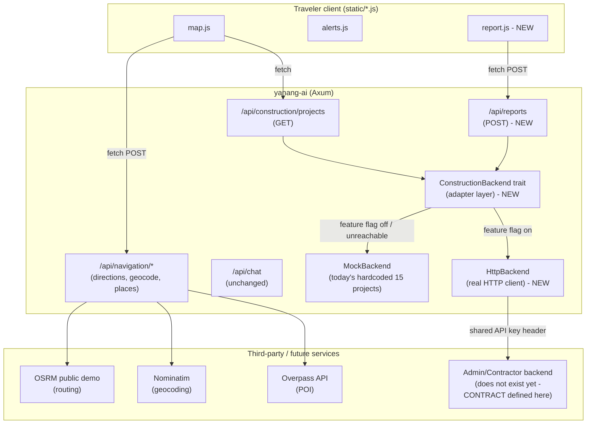
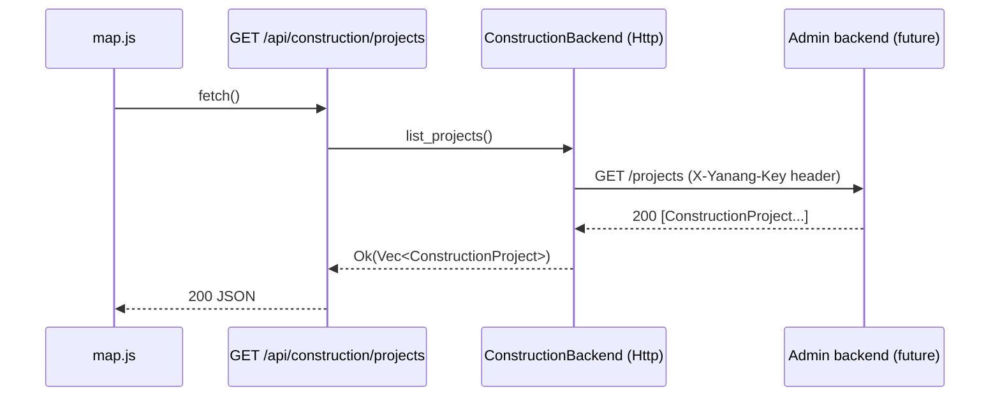
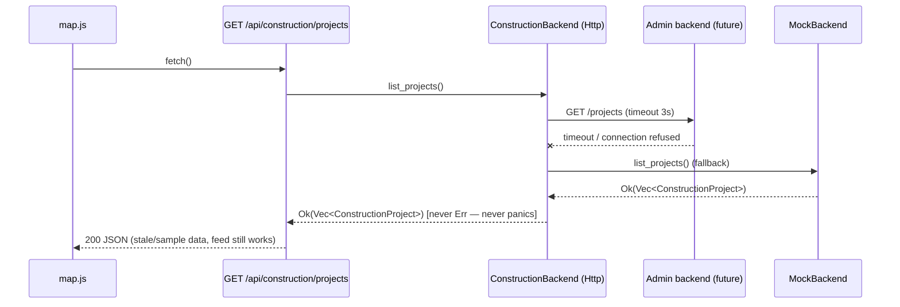
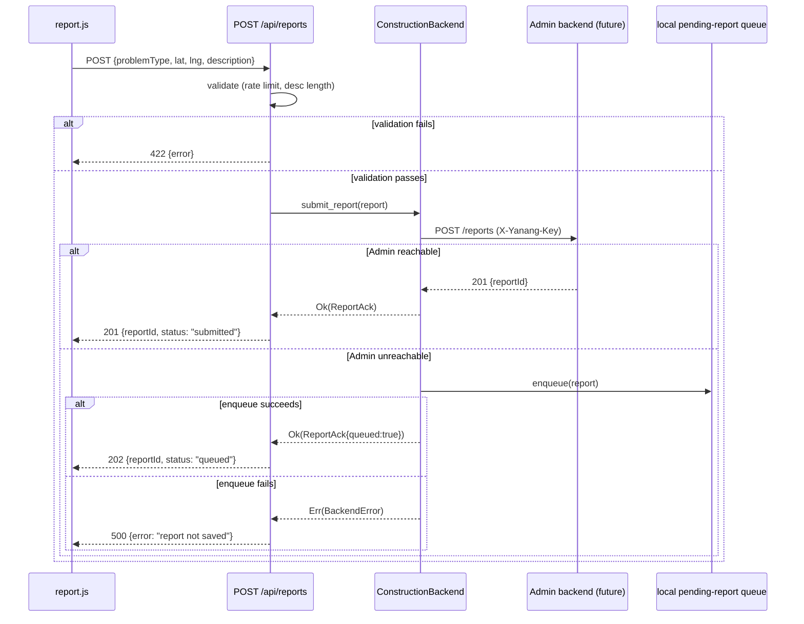

# Design Document: Yanang Traveler Integration

## Overview

ย่านาง AI (`yanang-ai/`) is the Traveler-facing role of the 3-role GPS chalui platform. Today it already does two things for real — live `watchPosition()` GPS tracking and real routing/geocoding via OSRM/Nominatim — but its construction-zone feed is 15 hardcoded records in `src/routes/construction.rs`, and there is no way for a citizen to send a report back to Admin. The Constructor/Admin side (`gps-construction/`, `gps-astro/`) is itself still a client-side-only prototype (localStorage + BroadcastChannel), so there is no real network backend anywhere yet.

This design does three things: (1) defines a **Backend Adapter** layer inside `yanang-ai` — a `ConstructionBackend` trait with a `MockBackend` (today's hardcoded data) and an `HttpBackend` (a real HTTP client against whatever URL the Constructor/Admin team eventually exposes) — so Yanang AI can flip a config flag and start talking to a real backend the moment one exists, without changing any route handler code; (2) confirms and hardens the already-real GPS/OSRM/Nominatim navigation path as the production path, replacing only the demo helper; (3) adds a citizen report submission endpoint + minimal frontend UI, using the same adapter pattern so reports go to Admin once Admin has an inbox, and are queued locally otherwise. The existing push-to-talk `VoiceContext` contract in `chat.rs` is not touched.

Because the "real" Admin backend does not exist as a network service yet, the primary deliverable of this design is the **contract** (request/response shapes, polling cadence, auth header) that whichever team builds that service must implement, plus a working adapter+mock today so the demo is never blocked on that other team's timeline.

## Architecture



**Key architectural decision — the adapter, not the route, decides mock vs. real.** `construction.rs` and the new `reports.rs` route handlers call `state.construction_backend.list_projects()` / `.submit_report()` — they never know whether they're talking to the mock data or a real HTTP service. Switching to the real Admin backend when it exists is a one-line config change (`YANANG_ADMIN_BASE_URL` env var set → `HttpBackend`; unset → `MockBackend`), not a rewrite. This directly serves the "prepare to integrate now, flip on later" requirement.

**Graceful degradation.** `HttpBackend` always falls back to `MockBackend`'s in-memory data if the real backend times out or errors — the map must never show a blank/broken feed. Report submission instead queues locally (see Data Models → `PendingReport`) and retries, since a report must not be silently lost.

## Sequence Diagrams

### Construction feed — real backend available (future state)



### Construction feed — real backend unavailable / not built yet (today + fallback)



### Citizen report submission



## Components and Interfaces

### Component 1: `ConstructionBackend` trait (adapter layer)

**Purpose**: Single seam that isolates every route handler from knowing whether construction-zone data and report submission talk to mock data or the real (future) Admin service.

**File**: `src/api/backend.rs` (new)

```rust
use async_trait::async_trait;
use crate::routes::construction::ConstructionProject;
use crate::routes::reports::{CitizenReport, ReportAck};

/// Adapter seam between Yanang AI routes and whatever powers the
/// construction-zone feed + citizen reports (mock today, real Admin
/// backend once the Constructor/Admin team ships one).
///
/// Implementations MUST NOT panic — network/parse failures are
/// reported as `BackendError`, and callers (routes) always have a
/// safe fallback path (see `HttpBackend`).
#[async_trait]
pub trait ConstructionBackend: Send + Sync {
    /// Returns the current active (non-completed) construction projects.
    /// MUST NOT return Err for a healthy MockBackend; MockBackend's
    /// list_projects is infallible.
    async fn list_projects(&self) -> Result<Vec<ConstructionProject>, BackendError>;

    /// Submits a citizen report. On success returns an ack with
    /// either `queued: false` (real backend accepted) or `queued: true`
    /// (stored locally pending the real backend becoming reachable).
    async fn submit_report(&self, report: CitizenReport) -> Result<ReportAck, BackendError>;
}

#[derive(Debug, Clone)]
pub enum BackendError {
    /// Real backend reachable but returned a non-2xx / malformed body.
    UpstreamError(String),
    /// Real backend not reachable at all (timeout, connection refused, DNS).
    Unreachable(String),
}
```

**Responsibilities**:
- `MockBackend`: wraps today's `sample_projects()` fn; `submit_report` always queues in-memory (never "sends" anywhere, since there is no admin yet in mock mode) and returns `queued: true`.
- `HttpBackend`: wraps `reqwest` calls to `YANANG_ADMIN_BASE_URL`; on any transport/timeout error for `list_projects`, silently falls back to an internal `MockBackend` instance rather than propagating `BackendError` up to the route (feed must always render); for `submit_report`, on transport/timeout error it enqueues to `PendingReportQueue` and returns `Ok(ReportAck{queued:true})` rather than failing the citizen's request.

### Component 2: Construction feed route (modified)

**File**: `src/routes/construction.rs` (existing file, handler body changes; struct + `sample_projects()` stay as the `MockBackend`'s data source)

**Interface**: unchanged wire contract — `GET /api/construction/projects` still returns `Vec<ConstructionProject>` with the same camelCase JSON shape `map.js` already parses. Only the handler body changes from "return hardcoded vec" to "delegate to `state.construction_backend`".

### Component 3: Report submission route (new)

**File**: `src/routes/reports.rs` (new)

**Interface**:
```rust
POST /api/reports
Request:  CitizenReportRequest { problem_type, lat, lng, description, photo_data_url? }
Response: 201 { reportId, status: "submitted" } | 202 { reportId, status: "queued" } | 422 { error }
```

**Responsibilities**:
- Validate `problem_type` against the fixed enum (aligned with `DATA_AND_AND.md` A7 `Feedback.problemType`).
- Enforce per-session rate limit (5 / 10 min) and description length (≤500 chars) — same invariants as `gps-construction/js/feedback.js`, now enforced server-side since this is a real network endpoint (client-side-only rate limiting is not trustworthy once there's a server).
- Find nearest construction project by Haversine (mirrors `findNearestZone` in `feedback.js` / `getNearbyProjects` in `alerts.js`) to populate `zoneId` before handing off to the adapter.

### Component 4: Frontend `report.js` (new)

**Purpose**: Minimal citizen-report UI reusing `alerts.js`'s Haversine/`getNearbyProjects` helper and `map.js`'s Leaflet instance, submitting to the new `/api/reports` endpoint. Styled consistently with the existing alert-banner / mini-chip patterns in `index.html`/`style.css`.

### Component 5: Navigation routes (confirmed, not rebuilt)

`src/routes/navigation.rs` + `src/api/gistda_maps.rs` already implement real routing/geocoding/POI search — this design formalizes them as the production path (see "Real GPS Navigation" below) and removes/relabels the `testConstructionAlert()` demo helper so it's clearly marked as dev-only, not a stand-in for real navigation.

## Data Models

All new/modified models are named to match the field vocabulary already established in `DATA_AND_AND.md` (the authoritative cross-role spec) so Yanang AI does not invent divergent field names.

### `ConstructionProject` (existing, unchanged wire shape)

```rust
// src/routes/construction.rs — UNCHANGED struct, still camelCase over the wire
pub struct ConstructionProject {
    pub id: u32,
    pub name: String,
    pub province: String,
    pub contractor: String,
    pub status: String,           // in-progress | delayed | planned | completed
    pub start: String,
    pub end: String,
    pub lat: f64,
    pub lng: f64,
    pub road_name: String,
    pub radius_km: f64,
    pub compliance_verdict: String, // pass | fail | pending
    pub closed_lanes: String,
    pub speed_limit: u32,
}
```

**Validation rules** (already implicit, made explicit for the `HttpBackend` parse path): `lat` in `[-90, 90]`, `lng` in `[-180, 180]`, `compliance_verdict` in `{pass, fail, pending}`, `status` in `{in-progress, delayed, planned, completed}`. If `HttpBackend` receives a project with an out-of-range field from the (future) Admin service, it MUST drop that single record (log + skip) rather than fail the whole feed — one malformed upstream record must not blank the map for every traveler.

### `CitizenReport` (new — aligned with DATA_AND_AND.md A6/A7)

```rust
// src/routes/reports.rs
#[derive(Debug, Deserialize)]
pub struct CitizenReportRequest {
    pub problem_type: String,      // no_cones | no_sign | data_mismatch | heavy_traffic | other
    pub lat: f64,
    pub lng: f64,
    pub description: Option<String>, // ≤ 500 chars, enforced server-side
    pub photo_data_url: Option<String>, // base64 data URL — optional, no real upload/storage in this design (see Scope Cuts)
}

#[derive(Debug, Clone, Serialize, Deserialize)]
pub struct CitizenReport {
    pub id: String,               // "fb-{timestamp}-{rand}"
    pub zone_id: Option<u32>,      // nearest project, via Haversine — None if none within threshold
    pub problem_type: String,
    pub description: String,       // already truncated to 500 chars server-side
    pub lat: f64,
    pub lng: f64,
    pub status: String,            // always "pending" at creation
    pub created_at: String,        // ISO 8601
}

#[derive(Debug, Serialize)]
pub struct ReportAck {
    pub report_id: String,
    pub queued: bool,              // true if stored locally pending real backend
}
```

**Note on the fallible-enqueue path**: `submit_report` returns `Result<ReportAck, BackendError>` — the `Ok(ReportAck{queued:true})` case covers "Admin_Backend unreachable, but the local queue accepted it." If the local enqueue *itself* fails (e.g. lock contention error), `submit_report` returns `Err(BackendError::Unreachable(..))` and the route responds `500`, not `202` — the route must never synthesize a `queued: true` ack for a report that was not actually stored anywhere (see Property 11).

**Validation rules** (server-enforced, mirrors `gps-construction/js/feedback.js` client-side rules — see Correctness Properties for the PBT form of these):
- `problem_type` MUST be one of the 5 known values → 422 otherwise.
- `description` length after `.trim()` MUST be ≤ 500 chars; the server truncates rather than rejects for lengths over 500 chars trimmed from client (defense in depth; UI already caps input).
- Per-session (identified by an `X-Session-Id` header the frontend generates once via `crypto.randomUUID()` and persists in `localStorage`) rate limit: max 5 submissions / rolling 10-minute window → 422 with retry-after seconds on the 6th.
- `lat`/`lng` MUST be finite and in valid Earth ranges → 422 otherwise.

### `PendingReport` queue (new — in-memory, adapter-internal)

```rust
// src/api/backend.rs
struct PendingReportQueue {
    items: tokio::sync::Mutex<Vec<CitizenReport>>,
}
```
Not persisted to disk in this design (hackathon timeline — see Scope Cuts). Retried on a background interval (every 60s) by `HttpBackend` while the process is alive; drained on successful retry.

### Alert / Feedback field alignment table

| Yanang AI field (this design) | `DATA_AND_AND.md` field | Note |
|---|---|---|
| `CitizenReport.zone_id` | `Feedback.zoneId` | same nearest-zone linking semantics |
| `CitizenReport.problem_type` | `Feedback.problemType` | same 5-value enum |
| `CitizenReport.description` | `Feedback.description` | same ≤500 char rule |
| `CitizenReport.status` | `Feedback.status` (`pending`\|`resolved`) | Yanang AI only ever writes `pending`; `resolved` is set by Admin |
| (not modeled — no compliance write-back yet) | `Feedback.needsReaudit` trigger (≥3 same-type) | Admin-side responsibility once Admin has a real backend; out of scope for Yanang AI's adapter (see Scope Cuts) |

## Real GPS Navigation

**Current state confirmed by reading the code**: `static/map.js:initMap()` already calls `navigator.geolocation.watchPosition()` with `enableHighAccuracy: true` for continuous live tracking (not a simulation), and `drawRoute()` renders the real GeoJSON polyline returned by `POST /api/navigation/directions`, which is backed by the public OSRM demo server and Nominatim in `src/api/gistda_maps.rs`. `testConstructionAlert()` is explicitly a demo-only helper for the proximity *alert*, not a navigation mock — it fakes a position 300m from a project purely so the alert banner can be shown on demand without physically driving there.

**Formalization for this design**:
1. Treat `watchPosition` + OSRM `/api/navigation/directions` + Nominatim `/api/navigation/geocode` as the one and only production navigation path. No change needed to make it "real" — it already is.
2. Rename `testConstructionAlert()`'s exposure so it's unambiguous: keep the function but relabel the UI chip from "🧪 ทดสอบแจ้งเตือน" (already reasonably labeled as a test) — no functional change required, just confirm in code comments that this is dev/demo-only and not a routing/GPS substitute (already true; documented here for the record).
3. **Reliability risk (flagged per requirement)**: `router.project-osrm.org` and `nominatim.openstreetmap.org` are free, unauthenticated, third-party demo endpoints with no SLA. For a hackathon demo this is an acceptable risk, but the design adds:
   - A request timeout (already 120s client-wide default in `AppState`; tighten to a per-call 8s timeout specifically for navigation calls so a slow OSRM demo server doesn't hang the UI past a usable point).
   - Typed error propagation (see Correctness Properties) so a 4xx/5xx/timeout from OSRM/Nominatim becomes a clean `502 Bad Gateway` with a Thai-language error message to the frontend instead of a panic or an opaque hang — this already mostly works (`gistda_maps.rs` returns `Result<_, String>`, routes map errors to `502`), this design just adds the tightened timeout and a `#[cfg(test)]` proptest guaranteeing no panics on malformed upstream JSON.
   - **Self-hosting OSRM/Nominatim** is explicitly called out as a *future* production hardening step, not part of this hackathon-scoped design (see Scope Cuts) — it requires standing up a Docker OSRM instance with Thailand OSM extract, which is multi-hour infra work disproportionate to the remaining time.

## Optional / Stretch: katgpt-rs-grounded LLM differentiation

This section is explicitly optional and should only be attempted after the core adapter + report endpoint + navigation confirmation above are working end-to-end. Do not start this until the demo path is solid.

Grounded in what's actually in `/home/eggchad/eakject/research/Deep_Man/katgpt-rs/crates/` (not invented):

1. **`katgpt-claim` (Claim-Level Reliability, L1/L2/L3 evidence ladder + sigmoid-projection vote)** — could gate whether ThaiLLM's answer about a construction zone is allowed to state a claim ("this road is closed") vs. hedge, based on whether the claim is backed by an actual `ConstructionProject` record in context (L1: no evidence → must hedge; L2/L3: backed by feed data → can state directly). This is a natural fit because `chat.rs` already builds a grounded context from `nearby_projects` — `katgpt-claim` would add a confidence-gated filter on top of the existing `build_voice_context_prompt_fragment()` output, deciding whether to keep or soften a claim before it reaches the LLM prompt.
2. **`katgpt-sense` (octree + BAKE precision-gated update, already partially the conceptual basis for `ai-auditor.js`'s hash/merkle-octree idea per `README.md`)** — could back a "confidence decays over distance/time" model for how strongly Yanang AI should assert a project's status the further the project is from the user's current fix or the older the last-known compliance verdict is. This is speculative and would require nontrivial glue code; only pursue if `katgpt-claim` integration lands early and time remains.
3. **`katgpt-validator` (syntax pruner)** is not a good fit here (it validates generated code, not natural-language claims) — explicitly excluded.
4. Both `katgpt-claim` and `katgpt-sense` are `publish = false` internal crates (not on crates.io, unlike `katgpt-types`/`katgpt-personality` which `yanang-ai` already depends on via crates.io). Using them would require a `path = "..."` dependency into the sibling repo or vendoring — this is extra build/dependency-management risk on a hackathon timeline and should be weighed against the payoff before starting.

**If time is short: skip this section entirely.** The existing `katgpt-personality` (sigmoid-gated style blending) and `katgpt-types` dependencies, plus the `SalienceTriGate` proactive-speak logic already in `engine/salience.rs`, are themselves a defensible "LLM application" story for the hackathon's LLM prize without any new katgpt-rs integration work.

## Correctness Properties

These are the properties this design should be validated against with property-based tests (Rust `proptest`, already a dev-dependency; frontend properties via `fast-check`, already a devDependency per `package.json`).

### Property 1: Feed proxy never panics and never returns fewer than zero projects

For any simulated upstream response (malformed JSON, empty body, timeout, valid-but-empty array, valid array with some out-of-range lat/lng records), `HttpBackend::list_projects()` returns `Ok(Vec<ConstructionProject>)` — never `Err`, never a panic — and the returned vec contains only records passing the validation rules above (out-of-range records dropped, not causing the whole call to fail).

**Validates: Requirements 1.3, 1.4, 1.6**

### Property 2: Feed proxy fallback is transparent to the route

For any adapter configuration (`MockBackend` or `HttpBackend` with a forced-unreachable upstream), `GET /api/construction/projects` always returns HTTP 200 with a JSON array (never 5xx due to upstream unavailability) — the route layer cannot observe which backend served the data.

**Validates: Requirements 1.1, 1.2, 1.5**

### Property 3: Report validation is a total function of (problem_type, description, lat, lng, session submission history)

For any input, `validate_report()` returns exactly one of `{Accepted, RejectedInvalidType, RejectedTooLong, RejectedRateLimited, RejectedInvalidCoords}` — no input causes a panic, and results are deterministic (same input + same rate-limit state ⇒ same result).

**Validates: Requirements 2.2, 2.3, 2.5**

### Property 4: Rate limiting is monotonic and window-correct

For any sequence of submission timestamps from one session, the Nth submission within any rolling 10-minute window is rejected iff N > 5 for that window; a submission that is >10 minutes after the oldest of the last 5 in the window is always accepted (matches `gps-construction/js/feedback.js`'s `canSubmitFeedback()` semantics, now re-implemented server-side).

**Validates: Requirements 2.5**

### Property 5: Description truncation is idempotent and length-preserving up to the cap

For any string `s`, `truncate_description(s).len() <= 500` (in chars, not bytes — Thai text must not be corrupted mid-codepoint), and if `s.len() <= 500` then `truncate_description(s) == s.trim()`.

**Validates: Requirements 2.4**

### Property 6: Nearest-zone linking is consistent with Haversine ordering

For any point and any non-empty project list, the `zone_id` attached to a report is the project with the minimum Haversine distance to that point among all projects in the list — ties broken by lowest `id`. This must match the existing `getNearbyProjects`/`findNearestZone` distance semantics already tested informally in `alerts.js`/`feedback.js`.

**Validates: Requirements 2.6**

### Property 7: Proximity alert triggering is monotonic in distance and respects suppression

(Regression property for existing `alerts.js`, re-validated because this design proposes no change to it but depends on its correctness for the demo.) For any zone and any two user positions where position A is strictly closer to the zone than position B and both are within `ALERT_RADIUS_M`, if an alert fires for B it must also fire for A when checked at the same suppression-window state; once fired, no repeat alert for the same zone fires again within `ALERT_SUPPRESS_MS` unless the zone was marked `exited` (distance > radius) in between.

**Validates: Requirements 4.1, 4.2, 4.3**

### Property 8: Voice_Context contract is untouched

(Regression property.) `ChatRequest` deserializes identically for any payload with or without `voice_context`, and `build_voice_context_prompt_fragment` behavior is byte-for-byte unchanged — this design adds no fields to `ChatRequest`/`VoiceContext`/`GeoPoint`/`NearbyProjectContext`. Existing property tests 19/20 in `chat.rs` continue to pass unmodified.

**Validates: Requirements 5.1, 5.2, 5.3**

### Property 9: Navigation adapter errors are typed, not panics

For any malformed/error response from OSRM or Nominatim (non-200, missing fields, non-JSON body, connection timeout), `get_directions`/`geocode`/`search_places` return `Err(String)` describing the failure — never panic, never an unhandled `unwrap()` on untrusted response data.

**Validates: Requirements 3.5, 3.6**

### Property 10: Report submission is idempotent under retry from the queue

If `submit_report` is retried from `PendingReportQueue` after a transient failure, the same `CitizenReport.id` is reused (not regenerated) so a (future) real Admin backend can deduplicate by id if the first attempt actually succeeded upstream but the ack was lost.

**Validates: Requirements 2.10**

### Property 11: Report submission response codes never overstate success

For any combination of (Admin_Backend reachable or not) × (local enqueue into `PendingReportQueue` succeeds or fails), `POST /api/reports` returns exactly one of `{201 submitted, 202 queued, 500 not-saved}`, and it returns `201` if and only if the Admin_Backend send actually succeeded, `202` if and only if the Admin_Backend send failed but the local enqueue succeeded, and `500` if and only if both the Admin_Backend send and the local enqueue failed. No input combination causes a `201`/`202` response when the report was not actually persisted somewhere (upstream or the queue).

**Validates: Requirements 2.7, 2.8, 2.9**

## Error Handling

### Scenario: Real Admin backend not yet built / unreachable

**Condition**: `YANANG_ADMIN_BASE_URL` unset, or set but connection fails/times out.
**Response**: `list_projects` falls back to `MockBackend` data; `submit_report` enqueues to `PendingReportQueue` and acks with `queued: true`.
**Recovery**: Once `YANANG_ADMIN_BASE_URL` is reachable, the background retry loop drains the queue on its next 60s tick; no manual intervention or restart needed.

### Scenario: Real Admin backend returns malformed project data

**Condition**: One or more records from the (future) `GET /projects` upstream fail validation (bad lat/lng, unknown status/verdict enum).
**Response**: Drop the offending record(s), log a warning with the record's `id` if present, return the rest.
**Recovery**: N/A — self-healing per request; does not require a restart.

### Scenario: Citizen submits invalid report

**Condition**: unknown `problem_type`, description >500 chars (pre-truncation reject — actually truncated per Property 5, so this scenario reduces to invalid type / coords / rate limit), out-of-range lat/lng, or rate limit exceeded.
**Response**: `422 Unprocessable Entity` with a Thai-language `{error}` message (mirrors existing Thai error strings in `feedback.js`).
**Recovery**: User corrects input and resubmits; rate limit recovers automatically after the window rolls forward.

### Scenario: Pending_Report_Queue enqueue itself fails

**Condition**: Admin_Backend is unreachable AND the local enqueue into `PendingReportQueue` also fails (e.g. an internal lock/panic-guard error) — a rare double-failure mode.
**Response**: `500 Internal Server Error` with an error message telling the citizen their report was **not** saved — this is deliberately distinct from the `202 queued` success-with-fallback response, so the app never claims a report was captured when it was not.
**Recovery**: User is expected to retry the submission; no silent data loss is masked as success.

### Scenario: OSRM/Nominatim/Overpass unreachable or slow

**Condition**: timeout or non-200 from third-party demo endpoint.
**Response**: `502 Bad Gateway` with a descriptive error string (existing behavior in `navigation.rs`, timeout tightened to 8s per navigation call in this design).
**Recovery**: User can retry; no queuing needed since navigation requests are not something to "not lose" the way a citizen report is.

## Testing Strategy

### Unit Testing

- `MockBackend::list_projects` returns the existing 15-project fixture unchanged (regression test — the demo's known-good data must not silently change).
- `validate_report` unit tests for each rejection reason.
- `find_nearest_zone` unit tests against the fixture project list with known-distance hand-computed cases.

### Property-Based Testing

**Library**: `proptest` (Rust, backend — already a dev-dependency in `Cargo.toml`) for properties 1, 3, 4, 5, 6, 9, 10. `fast-check` (JS, frontend — already a devDependency in `package.json`) for property 7 (regression on `alerts.js`, which is pure/testable via `vitest` the same way `voice-controller.test.js` already tests `voice-controller.js`) and any frontend-side mirroring of description truncation if the client also pre-truncates.

Each property above maps 1:1 to a `proptest!` block (backend) or `fc.assert(fc.property(...))` block (frontend), following the existing pattern in `chat.rs`'s `voice_context_tests` module (arbitrary generators per field, `prop_assert!`/`prop_assert_eq!` assertions, `ProptestConfig { cases: 100, .. }`).

### Integration Testing

- Boot the Axum app with `HttpBackend` pointed at a local mock HTTP server (e.g. `wiremock` or a hand-rolled `tokio::net::TcpListener` stub) that can be configured to time out / 500 / return malformed JSON on demand, and assert the `/api/construction/projects` route still returns 200 with valid fallback data in every failure mode.
- End-to-end manual test script (documented in tasks, not automated given hackathon timeline): submit a report from the browser UI, confirm 202 queued response when no `YANANG_ADMIN_BASE_URL` is set, confirm the report appears in `PendingReportQueue` via a debug-only `GET /api/reports/_pending` endpoint (dev-only, should be feature-flagged or removed before any real demo to avoid leaking an unauthenticated debug surface).

## Performance Considerations

- Navigation calls get an 8s per-request timeout (tightened from the 120s client default) so a slow OSRM/Nominatim response degrades the UI predictably rather than hanging.
- The construction feed is small (15-ish records) and polled by `map.js` once on load — no pagination or caching layer is needed at this scale. If the real Admin backend grows the feed to hundreds/thousands of projects, this design's `list_projects()` contract would need a bounding-box or radius query parameter — explicitly out of scope for now (see Scope Cuts) since the current feed is Bangkok-metro-sized and small.
- `PendingReportQueue` is a simple `Vec` behind a `Mutex` — fine for hackathon-scale report volume (tens, not thousands, of reports during a demo).

## Security Considerations

**All current and newly proposed endpoints are unauthenticated.** This is a real gap, not just a caveat: `GET /api/construction/projects`, the existing `/api/navigation/*` routes, and the new `POST /api/reports` accept requests from anyone, and the (future) call from `HttpBackend` to the Admin backend has no auth today either.

**Pragmatic hackathon-timeline approach**: introduce a **shared API key / service token** passed as an `X-Yanang-Key` header on the `HttpBackend → Admin backend` call, configured via a `YANANG_ADMIN_API_KEY` env var (mirrors the existing `YANANG_API_KEY` pattern already used for the ThaiLLM API in `main.rs`). This does **not** authenticate the citizen browser → Yanang AI leg (still open, matching current practice for `/api/chat` etc.) — it only authenticates the service-to-service leg (Yanang AI → Admin backend), which is the leg that matters most since it's the one writing data into another team's system.

**What real auth would look like** (explicitly not built now, documented so it's a conscious deferral): per-citizen session tokens or OAuth for the browser-facing endpoints to prevent report spam/abuse at scale, mutual TLS or signed-request auth (not a static shared secret) for the service-to-service leg, and rate limiting keyed by IP/device rather than a client-supplied session id (the current design's `X-Session-Id` is self-reported by the browser and trivially spoofable — acceptable for a hackathon demo, not for production).

## Dependencies

- **New Rust crate dependency**: `async-trait` (for the `ConstructionBackend` trait's async methods on `dyn` objects — Rust does not support async fns in traits used as trait objects without it as of this codebase's edition/toolchain). Pin to `async-trait = "0.1"` matching the loose-but-pinned-major convention already used for `axum = "0.8"` etc. in `Cargo.toml`.
- **No new frontend dependencies** — `report.js` reuses Leaflet (already loaded) and the existing `fetch`-based patterns in `map.js`/`app.js`.
- **Existing dependencies reused as-is**: `reqwest` (HttpBackend's HTTP client, same as `gistda_maps.rs` already uses), `serde`/`serde_json`, `tokio::sync::Mutex` (already available via the `tokio` "full" feature), `proptest` (dev-dependency, already present), `fast-check`/`vitest` (already present per `package.json`).

## Scope Cuts (explicit — decide before running out of time)

Given the "finish fast and demo-able" priority, cut these first if time runs short, in this order:

1. **Cut first: katgpt-rs stretch section entirely.** Zero core-path risk if skipped; `katgpt-personality`/`SalienceTriGate` already satisfy the "LLM application" story.
2. **Cut second: photo upload (`photo_data_url`) in citizen reports.** Accept the field as optional and simply drop/ignore it server-side (no storage) rather than building real image handling — matches `gps-construction/js/feedback.js`'s own POC-level "mock — no real upload" comment, so this is consistent with the rest of the platform's current maturity.
3. **Cut third: background retry loop for `PendingReportQueue`.** If cut, reports still get accepted with `queued: true` and stored in-memory, but only flushed on the next successful `list_projects`-style adapter call rather than a dedicated timer — still correct, just less proactive.
4. **Do not cut**: the `ConstructionBackend` trait + `MockBackend`/`HttpBackend` split itself, the feed-never-panics fallback behavior, and the report validation/rate-limit rules — these are the actual "prepare to integrate" deliverable and the parts most likely to be graded/demoed.
5. **Do not cut**: confirming real GPS/OSRM/Nominatim as production (this requires no new work, only documentation/comment cleanup, so there's no time-cost reason to cut it).
